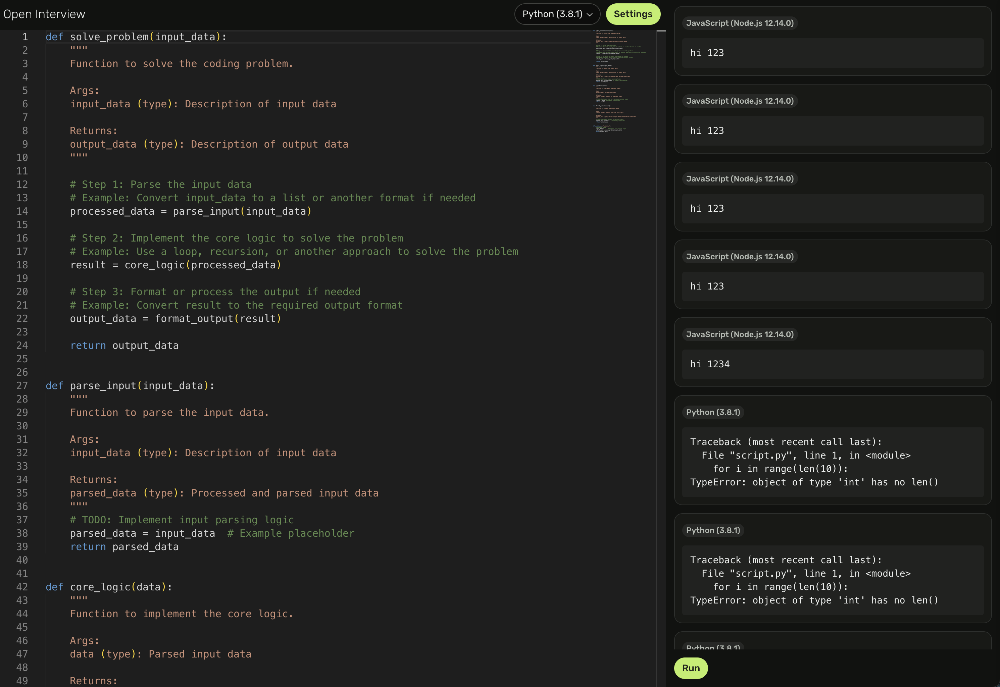

# Open Interview

## Overview

Open Interview is an open-source coding interview platform built with Next.js, making it easily deployable to your preferred hosting environment.

## Getting Started

### Authentication

By default, any user with access to the home page can create a new interview. To require authentication, set the following environment variables:

- `NEXT_PUBLIC_OPEN_INTERVIEW_AUTH_ENABLED`=true
- `OPEN_INTERVIEW_SECRET_KEY`=[your secure password]

### Database

LibSQL: Set the following environment variables to configure LibSQL:

- `LIBSQL_URL`=[your LibSQL instance URL]
- `LIBSQL_AUTH_TOKEN`=[your LibSQL auth token]

### Judge0 Integration

Open Interview uses the Judge0 platform as its code runtime engine. Set the following environment variables to integrate with Judge0:

- `JUDGE0_API_URL`=[your Judge0 API URL]
- `JUDGE0_AUTH_TOKEN`=[your Judge0 auth token]

### Real-time Server

Real-time collaboration and editing is powered by Y-Sweet, a platform similar to Y.js. Set the following environment variable to configure Y-Sweet:

`Y_SWEET_CONNECTION_STRING`=[your Y-Sweet connection string]

### Deployment

Open Interview is at its core, a Next.js application, so it can be deployed to any hosting platform that supports Next.js, such as Vercel, Netlify, or your own self-hosted solution.

## Contributing

Open Interview is an open-source project, and contributions are welcome. Please refer to the project's contribution guidelines for more information.
